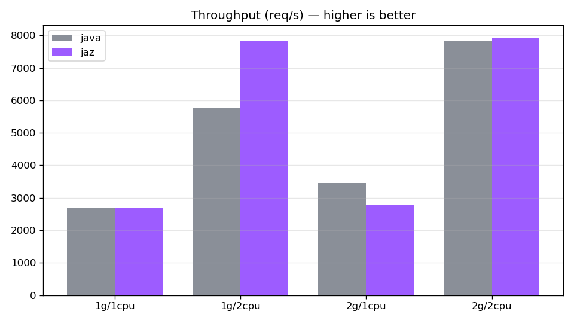
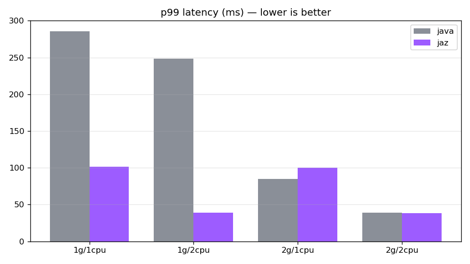
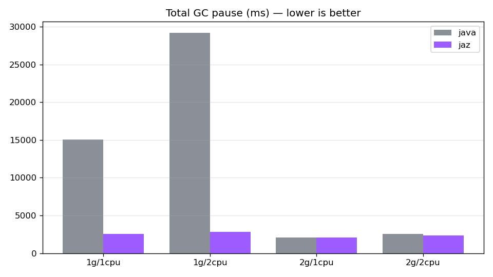
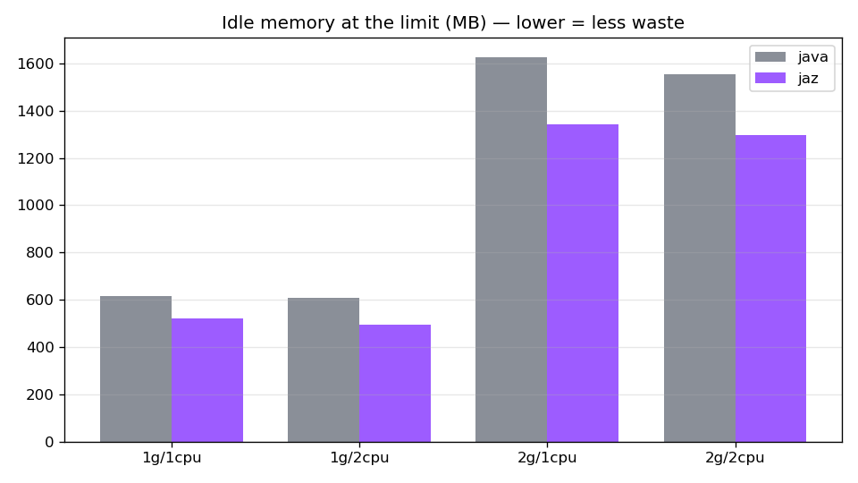

# jaz vs `java`: cloud JVM defaults on an I/O- and memory-bound workload

- **Status:** complete (ran on Azure, N=5)
- **Product under test:** [jaz, the Azure Command Launcher for Java](https://learn.microsoft.com/en-us/java/jaz/overview) (public preview)
- **Part of:** [TM Dev Lab experiments](../README.md)

## Question

Microsoft's **jaz** is a drop-in replacement for the `java` command. You run `jaz -jar app.jar`
instead of `java -jar app.jar`, and it applies cloud-optimized JVM tuning (heap sizing, GC choice,
diagnostics) inferred from the container's cgroup limits, with **no manual tuning**.

Does that actually beat the plain `java` defaults for a realistic, I/O- and memory-bound Java
microservice in a resource-constrained container, and by how much?

## Hypotheses

- **H1. Resource utilization (idle waste).** The plain `java` default caps the max heap at about
  25 percent of the container memory, leaving most of it idle. jaz uses more of the available memory,
  converting otherwise-idle memory into useful work. Measured via idle memory (limit minus peak),
  utilization, and throughput per GB granted.
- **H2. Throughput and tail latency.** Under sustained concurrent load, jaz delivers throughput at or
  above the default and **p99 (tail) latency** at or below the default, in the same resource envelope.
- **H3. GC efficiency.** jaz lowers GC overhead (total pause time) for the workload.

## Why a memory by CPU grid

The JVM's own ergonomics pick the default GC from whether the machine looks "server-class". G1 is the
default only with at least 2 available CPUs and at least 1792 MB of memory. Otherwise the JVM falls
back to Serial GC (single-threaded, stop-the-world), a poor fit for a concurrent server. The grid
straddles that boundary on purpose:

| default `java` picks | 1 vCPU | 2 vCPU |
|---|---|---|
| **1 GB** | Serial GC | Serial GC |
| **2 GB** | Serial GC | **G1 GC** |

This separates where jaz helps most (the small-container Serial-GC trap) from where the default
already picks G1 and jaz's edge is mostly heap sizing. The per-cell flag capture records the actual
GC and heap that the default and jaz each use.

## What jaz applies (observed at 1 GB / 2 vCPU)

`JAZ_DRY_RUN=1 jaz -jar app.jar` prints the exact `java` command jaz would run. On this bench:

| | plain `java` default | `jaz` |
|---|---|---|
| GC | Serial GC | **G1 GC** |
| Max heap | 256 MB (25 percent of RAM) | **732 MB (about 71 percent)** |
| Heap sizing | static | `MinHeapFreeRatio=10`, `MaxHeapFreeRatio=50`, `G1UseTimeBasedHeapSizing`, periodic GC |
| Diagnostics | none | Native Memory Tracking, error file |

Full per-cell captures land in `results/raw/<run>/_flags/`.

## Workload

`app/` is an in-memory **digital bank** (Spring Boot 4.1.0 / Java 21, Spring MVC, blocking
thread-per-request). Accounts and an append-only ledger live entirely on the heap. Each request
simulates a downstream I/O call by parking its thread (`BANK_IO_DELAY_MS`), so the workload is I/O-
and memory-bound rather than CPU-bound, the profile of most Java services. Endpoints cover open,
deposit, withdraw, transfer, balance, and statement. A warm set is preloaded so that heap sizing and
GC actually matter.

## Method

- **Arms (same image, app, JDK):** `java -jar` (default) versus `jaz -jar`. Nothing else changes.
- **Bench:** an Azure VM (`Standard_D4s_v5`, 4 vCPU / 16 GiB, `eastus`, kernel 6.17-azure, Xeon
  Platinum 8370C) running Docker. The workload runs in containers with the cgroup limits from the
  grid above.
- **Grid:** memory {1 GB, 2 GB} by {1, 2} vCPU, both launchers, at least 5 runs per cell.
- **Load:** k6 (`scripts/load.js`), roughly 70 percent reads (balance and statement) and 30 percent
  writes (deposit, withdraw, transfer) at fixed concurrency. A warmup phase is discarded before the
  measurement window.
- **Metrics:** throughput (req/s) and latency (avg/p50/p90/p95/p99 are all recorded, and **p99** is
  the reported tail-latency metric, matching H2), peak and idle memory and CPU usage (cgroup v2
  `memory.peak`, `memory.max`, `cpu.stat`), and GC total pause plus the chosen GC (`-Xlog:gc*`, which
  jaz does not treat as a tuning flag, so it still tunes). Startup time and the applied flags
  (`JAZ_DRY_RUN`, `PrintFlagsFinal`) are also captured. Each metric is reported as the median across runs, with the run-to-run spread (min, max, and coefficient of variation) recorded for throughput, p99, and GC pause.

## Reproduce

```bash
# 1. Build the image (multi-stage: JDK 21 build, MS OpenJDK 21 runtime that bundles jaz)
docker build -f docker/Dockerfile -t jaz-exp/digital-bank:21 .

# 2. Capture the test-bench environment
IMAGE=jaz-exp/digital-bank:21 bash scripts/env-capture.sh > ENVIRONMENT.md

# 3. Run the matrix (any knob is overridable via env)
MEMS="1g 2g" CPUS="1 2" RUNS=5 bash scripts/run-matrix.sh

# 4. Parse into results/processed/{runs,summary}.csv and summary.json
python3 scripts/parse.py

# 5. Charts into results/charts/
python3 scripts/charts.py
```

Everything is pinned and recorded in `ENVIRONMENT.md`: JDK (Microsoft Build of OpenJDK 21), jaz
version (`JAZ_PRINT_VERSION`), the app, the base image id, k6, and the VM size.

## Results

40 runs on the Azure VM (4 cells by 2 launchers by 5 reps), no out-of-memory, zero server errors.
Medians below. Full per-run data is in `results/processed/runs.csv`, charts in `results/charts/`.

| scenario | metric | java (default) | jaz | verdict |
|---|---|---|---|---|
| **1 GB / 2 vCPU** | throughput | 5749/s | **7847/s** | jaz +36 percent |
| Serial vs G1 | p99 | 249 ms | **39 ms** | jaz 6.4x better |
| | GC pause | 29217 ms | **2805 ms** | jaz 10x less |
| **1 GB / 1 vCPU** | throughput | 2692/s | 2698/s | tie |
| Serial vs G1 | p99 | 285 ms | **102 ms** | jaz 2.8x better |
| | GC pause | 15090 ms | **2533 ms** | jaz 6x less |
| **2 GB / 1 vCPU** | throughput | **3463/s** | 2778/s | java +25 percent |
| Serial vs G1 | p99 | **85 ms** | 100 ms | java better |
| | GC pause | 2044 ms | 2091 ms | tie |
| **2 GB / 2 vCPU** | throughput | 7830/s | 7915/s | tie |
| G1 vs G1 | p99 | 39 ms | 38 ms | tie |
| | GC pause | 2560 ms | 2320 ms | tie |

### Run-to-run variance

Dispersion across the 5 runs of each cell is low, and where the table shows a difference the two
arms' run ranges do not overlap. Throughput and p99 sit at a coefficient of variation (sample stdev
over mean) of roughly 1 to 5 percent. At 1 GB / 2 vCPU the throughput ranges are [5632, 5784] for
java and [7577, 8226] for jaz, so the +36 percent gap is well outside run-to-run noise. The only
higher CVs (7 to 11 percent) fall on the small GC-pause values of the 2 GB cells, where the absolute
pauses are tiny and the table already reports no meaningful difference. Per-cell min, max, and CV for
throughput, p99, and GC pause are in `results/processed/summary.csv`, and every run is in `runs.csv`.

### Verdict per hypothesis

- **H1 (idle waste): confirmed, conditional.** jaz always uses more of the container memory (higher
  peak, lower idle in every cell). That converts to useful work only under real memory pressure. At
  1 GB / 2 vCPU the larger heap becomes +36 percent throughput, while at 2 GB the extra heap sits
  mostly unused (throughput ties or regresses).
- **H2 (throughput and p99 tail latency): confirmed in three of four cells, not universal.** jaz
  meets or beats both throughput and p99 at 1g/1cpu, 1g/2cpu, and 2g/2cpu, dramatically at 1g/2cpu.
  It loses both at 2 GB / 1 vCPU, where the default's Serial GC is not under pressure and G1's
  overhead costs on a single core. The full latency distribution in `runs.csv` shows the win is
  concentrated at p99, sometimes at a small cost to the median.
- **H3 (GC efficiency): confirmed.** Wherever the default falls into Serial GC, jaz cuts total GC
  pause 6x to 10x. Where both use G1 (2 GB / 2 vCPU) they are even. This is the mechanism behind the
  p99 result.

### Charts






The flags jaz applied were identical on Azure and on a local Linux box (`-Xmx730m` versus `732m`,
same G1 and heap-sizing flags), so jaz's tuning is driven by the cgroup limits, not by anything
Azure-specific in this scenario.

## Honesty and caveats

- jaz is in public preview (`0.0.0-preview+...`), so results are a version-pinned snapshot.
- Much of jaz's benefit is (a) avoiding the JVM's own "Serial GC in small containers" default and
  (b) using more of the granted memory, which is exactly its pitch of better defaults without manual
  tuning. A specialist who profiles the workload could match it by hand, or beat it. The point of jaz
  is not having to be that specialist.
- The default `java` baseline is modern and already container-aware, a fair and strong baseline.
- Load is generated on the same VM as the app (no network noise), so client-observed latency is
  lower-bounded by the injected I/O delay. The comparison is arm-versus-arm under identical
  conditions.
- jaz sends telemetry to Microsoft, disclosed here.
